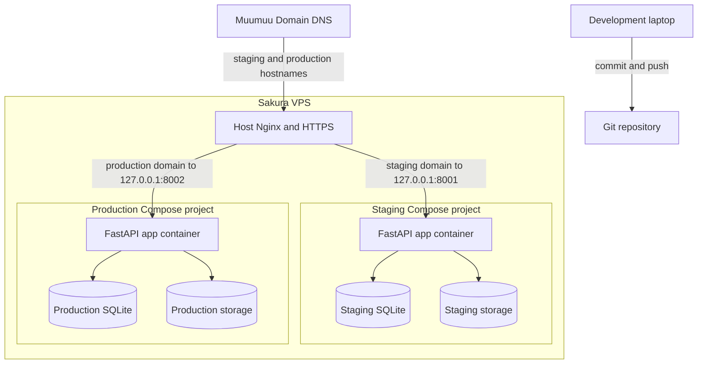

# Deployment Strategy

## Purpose

This document defines the deployment strategy for the NTCIR-19 ModelRetrieval submission system.

The goal is to support three environments:

- Development on a developer laptop or workstation.
- Staging on the Sakura VPS.
- Production on the same Sakura VPS.

The deployment model should keep staging and production isolated while staying simple enough for a small research-task operations team.

## Existing Documents Reused

The existing repository documents remain useful and should not be replaced.

- `requirements.md`: product and policy requirements.
- `architecture.md`: high-level VPS architecture.
- `implementation-plan.md`: Sprint 6 production-hardening scope.
- `HANDOFF.md`: continuation guide for future Codex sessions.
- `data-model.md`: database and persistence expectations.
- `submission-spec.md`: participant upload contract.
- `evaluation-spec.md`: evaluation and leaderboard behavior.
- `ui-flow.md`: user-facing workflow expectations.

This deployment document set adds operational detail for Sprint 6.

## Required Deployment Documents

Recommended document set:

- `deployment-strategy.md`: environment model, release flow, Docker Compose recommendation, and rollback strategy.
- `deployment-environments.md`: per-environment domains, data paths, environment variables, and secrets.
- `deployment-runbook.md`: setup, deploy, promote, rollback, backup, and restore commands.
- `deployment-checklist.md`: pre-launch and per-release verification checklist.

These four documents are enough before writing deployment code, service files, or CI/CD workflows.

## Recommended Architecture

Use Docker Compose for the FastAPI application, with Nginx running on the VPS host.



```text
Muumuu Domain DNS
  -> Sakura VPS public IP
    -> host Nginx + HTTPS
      -> staging app container on localhost port 8001
      -> production app container on localhost port 8002
```

Staging and production should be separate Compose projects with separate persistent data directories.

```text
/opt/modelretrieval/
  staging/
    compose.yml
    .env
    data/
      app.sqlite3
      storage/
  production/
    compose.yml
    .env
    data/
      app.sqlite3
      storage/
  backups/
```

Repository deployment files:

- `Dockerfile`: production-oriented FastAPI/Uvicorn image.
- `compose.staging.yml`: staging Compose project on `127.0.0.1:8001`.
- `compose.production.yml`: production Compose project on `127.0.0.1:8002`.
- `deployment/staging.env.example`: staging environment template.
- `deployment/production.env.example`: production environment template.
- `deployment/nginx/staging.bootstrap.conf.example`: temporary HTTP staging template for first certificate issuance.
- `deployment/nginx/production.bootstrap.conf.example`: temporary HTTP production template for first certificate issuance.
- `deployment/nginx/staging.conf.example`: Nginx staging reverse-proxy template.
- `deployment/nginx/production.conf.example`: Nginx production reverse-proxy template.

## Why Docker Compose

Docker Compose is recommended because:

- Staging and production can run side by side on one VPS.
- Python, uv, and system dependencies are reproducible.
- Production deployment does not depend on a mutable checkout state.
- Environment variables, SQLite files, and upload storage can be isolated cleanly.
- Rollback can use a previous image tag.
- Nginx can remain on the host, which keeps HTTPS and domain routing familiar.

The Compose setup should stay small: one application container per environment is enough.

## Environment Model

### Development

Development runs on a laptop or local workstation.

Recommended behavior:

- Run with `uv run uvicorn app.main:app --reload`.
- Use local SQLite under `var/app.sqlite3`.
- Use local storage under `var/storage`.
- Use a development-only `SECRET_KEY`.
- No public DNS or HTTPS required.

### Staging

Staging runs on the Sakura VPS and should mirror production as closely as practical.

Recommended behavior:

- Domain: `staging.<domain>`.
- Current project domain: `submission-staging.modelretrieval-1.happysocial.net`.
- Host Nginx proxies to `127.0.0.1:8001`.
- Compose project name: `modelretrieval-staging`.
- Persistent data path: `/opt/modelretrieval/staging/data`.
- Auto-deployed after tests pass on the main branch.
- Safe to reset or reseed if needed, but only intentionally.

### Production

Production runs on the same Sakura VPS.

Recommended behavior:

- Domain: `submit.<domain>` or the official task domain.
- Current project domain: `submission.modelretrieval-1.happysocial.net`.
- Host Nginx proxies to `127.0.0.1:8002`.
- Compose project name: `modelretrieval-production`.
- Persistent data path: `/opt/modelretrieval/production/data`.
- Deployed only by an explicit promotion action, such as a version tag.
- Automatic backup should run before each production deploy.

## DNS And Nginx

Use Muumuu Domain DNS to point staging and production hostnames to the Sakura VPS public IP.

Example:

```text
staging.example.jp  A  <sakura-vps-ip>
submit.example.jp   A  <sakura-vps-ip>
```

Use Nginx on the host to terminate HTTPS and route by hostname.

```text
staging.example.jp -> 127.0.0.1:8001
submit.example.jp  -> 127.0.0.1:8002
```

Use Certbot with the Nginx plugin or an equivalent Let's Encrypt workflow.

Nginx should preserve forwarded headers, allow uploads larger than the app's 10 MB limit, and keep staging and production upstreams bound to localhost only.

## Release Flow

Recommended release flow:

```mermaid
flowchart LR
  commit[Commit locally]
  push[Push to main]
  ci[CI tests and lint]
  build[Build Docker image]
  registry[Push image to registry]
  staging_deploy[Deploy staging]
  verify[Manual staging verification]
  tag[Create v* tag]
  backup[Production backup]
  prod_deploy[Deploy production]
  smoke[Production smoke check]
  rollback[Rollback to previous image tag]

  commit --> push --> ci --> build --> registry --> staging_deploy --> verify --> tag
  tag --> backup --> prod_deploy --> smoke
  smoke -. if failed .-> rollback
  rollback --> smoke
```



```text
developer laptop
  -> commit
  -> push to main
  -> CI test and lint
  -> build Docker image
  -> deploy staging automatically
  -> manual staging verification
  -> create version tag
  -> CI deploys production
```

Use the following mapping:

- Push to `main` or `master`: deploy staging.
- Tag `v*`: deploy production.

This keeps staging fast and production deliberate.

## Image Strategy

Use a container registry such as GitHub Container Registry.

Recommended tags:

- `main-<short-sha>` for staging.
- `vYYYY.MM.DD` or semantic version tags for production.
- `latest-staging` may be convenient, but production should use immutable tags.

Production should record the deployed image tag in deployment logs.

The repository provides `.github/workflows/ci-cd.yml` for:

- test and lint on pull requests and pushes;
- Docker image publishing to GitHub Container Registry on pushes;
- automatic staging deployment from branch pushes;
- production deployment from `v*` tags;
- production backup before deployment;
- smoke checks after deployment.

## Persistent Data

Never store production data inside the Docker image.

Mount persistent data into the container:

```text
/data/app.sqlite3
/data/storage
```

The app should receive:

```text
DATABASE_PATH=/data/app.sqlite3
STORAGE_ROOT=/data/storage
```

Backups must include both the SQLite database and storage directory.

## Backup Strategy

For production:

- Run daily backups during active submission periods.
- Run an automatic backup before each production deployment.
- Run a manual backup before ground-truth replacement or re-evaluation.
- Keep at least one offline copy after the task ends.

Backup content:

- SQLite database.
- Uploaded submissions.
- Uploaded ground-truth files.
- Generated bundles and exports if needed.
- Production `.env` file or an encrypted copy of operational secrets.

The repository provides:

- `deployment/scripts/backup.sh`: creates a timestamped SQLite/storage backup with a manifest.
- `deployment/restore.md`: describes how to restore database and storage together.

## Rollback Strategy

Application rollback:

- Redeploy the previous Docker image tag.
- Do not roll back the SQLite database unless a migration or data corruption requires it.

Data rollback:

- Restore database and storage together from the same backup timestamp.
- Stop the production container before restore.
- Start production and run smoke checks after restore.

The first deployment iteration should avoid schema migrations. If migrations are added later, migration and rollback rules should be documented before production use.

## Security Baseline

Minimum production expectations:

- HTTPS enabled for staging and production.
- Unique `SECRET_KEY` per environment.
- Production `.env` readable only by the deployment user or root.
- Database and storage directories are not inside the Nginx web root.
- Ground-truth files are not served as static files.
- SSH access uses keys.
- Firewall allows only SSH, HTTP, and HTTPS publicly.
- Docker containers bind application ports to `127.0.0.1`, not `0.0.0.0`.

## Recommendation

Use Docker Compose with host Nginx.

Use automatic deployment to staging from `main`, and tag-based promotion to production. Keep staging and production separate through Compose project names, domains, ports, `.env` files, SQLite databases, and storage directories.
