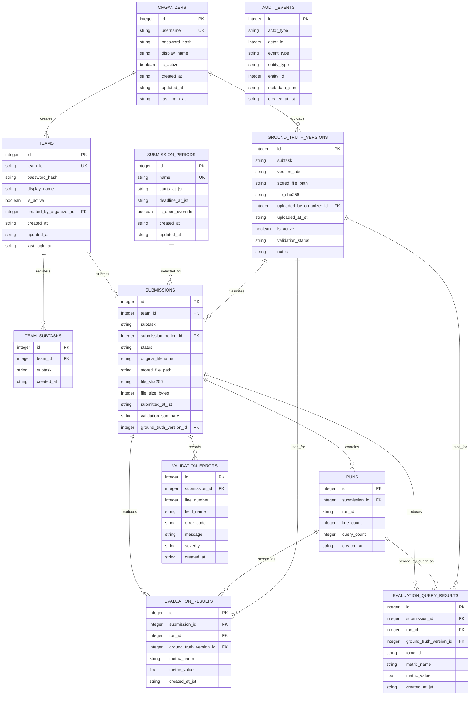

# Data Model

## Entity Overview

Core entities:

- Organizer users.
- Teams.
- Subtasks.
- Submission periods.
- Submissions.
- Submitted runs.
- Validation errors.
- Ground-truth versions.
- Evaluation results.
- Per-query evaluation results.
- Audit events.

## Implementation Status

The implemented SQLite schema includes the current core entities below. This document also records the planned `evaluation_query_results` table for organizer-only per-query diagnostics. Use `../../HANDOFF.md` for the detailed current implementation checkpoint.

Participant upload attempts use:

- `rejected` for failed validation attempts.
- `accepted` only transiently before successful evaluation persistence.
- `evaluated` for valid submissions with persisted metric rows.
- `evaluation_failed` when a valid stored submission cannot be evaluated.

Submissions store the selected `submission_period_id`, and the partial unique index enforces one successful submission per team, subtask, and selected period.

Per-query evaluation result persistence is planned but not yet implemented in the current schema.

## ER Diagram

## organizers

Stores organizer/admin accounts.

Suggested fields:

- `id`
- `username`
- `password_hash`
- `display_name`
- `is_active`
- `created_at`
- `updated_at`
- `last_login_at`

Notes:

- Organizer login uses passwords only.
- Organizers can change their own password.
- Authorized organizers can create new organizer users with generated passwords.

## teams

Stores registered participant teams.

Suggested fields:

- `id`
- `team_id`
- `password_hash`
- `display_name`
- `is_active`
- `created_by_organizer_id`
- `created_at`
- `updated_at`
- `last_login_at`

Notes:

- `team_id` is the primary external identifier.
- Each team has one shared account.
- Generated passwords may be shown to organizers.

## team_subtasks

Stores which subtasks each team can submit to.

Suggested fields:

- `id`
- `team_id`
- `subtask`
- `created_at`

Allowed `subtask` values:

- `A`
- `B`

## submission_periods

Stores normal and late submission windows.

Suggested fields:

- `id`
- `name`
- `starts_at_jst`
- `deadline_at_jst`
- `is_open_override`
- `created_at`
- `updated_at`

Default rows:

- `normal`, deadline `2026-08-01 15:00:00 JST`
- `late`, deadline `2026-10-15 23:59:00 JST`

Notes:

- Organizers can reopen a closed period using `is_open_override`.
- Submission rows store the participant-selected period used at upload time.
- The system validates the selected period against the deadline and reopen override before accepting the upload.

## submissions

Stores upload attempts and successful submissions.

Suggested fields:

- `id`
- `team_id`
- `subtask`
- `submission_period_id`
- `status`
- `original_filename`
- `stored_file_path`
- `file_sha256`
- `file_size_bytes`
- `submitted_at_jst`
- `validation_summary`
- `ground_truth_version_id`

Allowed `status` values:

- `rejected`
- `accepted`
- `evaluated`
- `evaluation_failed`

Rules:

- Only one successful submission is allowed per team, subtask, and period.
- Validation failures are retained forever.
- Successful submissions are retained forever.

## runs

Stores distinct `RunID` values found in an accepted submission.

Suggested fields:

- `id`
- `submission_id`
- `run_id`
- `line_count`
- `query_count`
- `created_at`

Rules:

- Maximum 5 runs per accepted submission.
- All runs are official.

## validation_errors

Stores validation errors for rejected submissions.

Suggested fields:

- `id`
- `submission_id`
- `line_number`
- `field_name`
- `error_code`
- `message`
- `severity`
- `created_at`

Notes:

- Ranking/score-order mismatches should use warning-style messaging but still reject the submission.

## ground_truth_versions

Stores organizer-uploaded ground-truth versions.

Suggested fields:

- `id`
- `subtask`
- `version_label`
- `stored_file_path`
- `file_sha256`
- `uploaded_by_organizer_id`
- `uploaded_at_jst`
- `is_active`
- `validation_status`
- `notes`

Notes:

- Files are stored on the server local filesystem.
- Participants must never access these files.

## evaluation_results

Stores run-level evaluation scores.

Suggested fields:

- `id`
- `submission_id`
- `run_id`
- `ground_truth_version_id`
- `metric_name`
- `metric_value`
- `created_at_jst`

Metric names:

- `ndcg@1`
- `ndcg@3`
- `ndcg@5`
- `mrr`

Notes:

- Subtask A uses macro-averaged nDCG.
- Subtask B uses MRR.
- Re-evaluation creates new result rows tied to the new ground-truth version.

## evaluation_query_results

Stores organizer-only per-query evaluation scores.

Suggested fields:

- `id`
- `submission_id`
- `run_id`
- `ground_truth_version_id`
- `topic_id`
- `metric_name`
- `metric_value`
- `created_at_jst`

Metric names:

- `ndcg@1`
- `ndcg@3`
- `ndcg@5`
- `reciprocal_rank`

Notes:

- Per-query rows are diagnostic records for organizers.
- Participant pages must not query or render this table.
- Leaderboard sorting and CSV export should continue to use `evaluation_results`.
- Re-evaluation creates new per-query result rows tied to the new ground-truth version.

## audit_events

Stores important organizer and participant actions.

Suggested fields:

- `id`
- `actor_type`
- `actor_id`
- `event_type`
- `entity_type`
- `entity_id`
- `metadata_json`
- `created_at_jst`

Useful event types:

- `team_created`
- `team_password_generated`
- `organizer_created`
- `organizer_password_changed`
- `submission_uploaded`
- `submission_rejected`
- `submission_evaluated`
- `ground_truth_uploaded`
- `ground_truth_activated`
- `period_reopened`
- `leaderboard_exported`
- `submission_bundle_downloaded`
