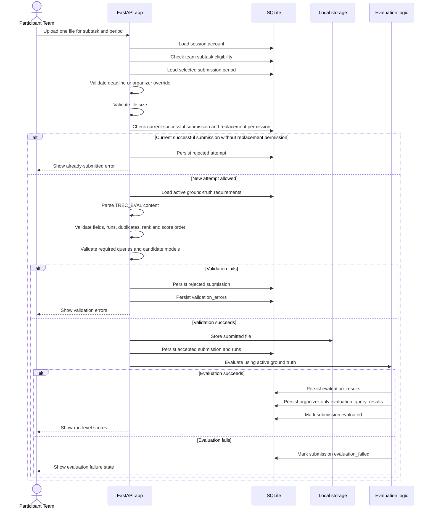

# Submission Specification

## Supported Subtasks

The system supports two independent subtasks:

- Subtask A: Pre-trained BERT Model Retrieval.
- Subtask B: Image Style Transfer LoRA Model Retrieval.

Each subtask has its own submission limit of up to 5 runs per team per submission turn.

Each upload must be a single file. Filename extensions are not used to accept or reject submissions.
Files with any extension, or no extension, are accepted when their content is valid TREC_EVAL text.

Maximum upload size: 50 MB.

## Implementation Status

The participant upload workflow and validation behavior are implemented. Use `../../HANDOFF.md` for the detailed current implementation checkpoint.

## Submission Workflow Diagram



## Submission Turns

The system supports:

- Normal submission.
- Late submission.

All submission windows and deadlines are enforced in JST.

For each team, subtask, and submission turn, only one current successful submission is allowed. Participants may retry until validation succeeds.

If an organizer grants one-time replacement-upload permission, a team may upload another file for the same team, subtask, and submission turn while the selected period is open or reopened. A successful replacement becomes current and supersedes the previous successful submission. Failed replacement validation attempts do not consume permission.

Participants choose the submission turn explicitly during upload. The system validates the selected turn against its JST deadline and organizer reopen override. The system must not automatically assign normal or late based only on server time.

Default deadlines in JST:

- Normal submission: August 1, 2026 at 15:00.
- Late submission: October 15, 2026 at 23:59.

## File Format

Every run must use TREC_EVAL format:

```text
topicID Q0 docID Rank Score RunID
```

Example:

```text
1 Q0 1 1 0.99 Run01
1 Q0 7 2 0.95 Run01
```

## Field Rules

| Field | Rule |
|---|---|
| `topicID` | Must be a valid query/task ID for the selected subtask. For Subtask B this is the `image_id`, which matches with or without a `.png` suffix. |
| `Q0` | Must be exactly `Q0`. |
| `docID` | Must be a valid candidate model ID for the selected subtask. For Subtask B this is the `model_id`, which matches numerically regardless of left zero-padding. |
| `Rank` | Must be a positive integer where `1` is the highest rank. |
| `Score` | Must be a numeric predicted score. |
| `RunID` | Must identify the submitted run. |

### Subtask B image ID matching

For Subtask B, the `topicID` is the query `image_id`. Image IDs are matched against
ground truth after stripping an optional trailing `.png` suffix, so `test-0001-0011`
and `test-0001-0011.png` are treated as the same image. This tolerance applies in
both directions: a `.png` suffix present in the ground truth, in the submission, or
in neither is accepted. Subtask A topic IDs are matched exactly and do not treat
`.png` as special.

### Subtask B model ID matching

For Subtask B, the `docID` is the candidate `model_id`. Numeric model IDs are matched
after removing left zero-padding, so `0001` and `1`, or `0111` and `111`, refer to the
same model. This tolerance applies in both directions between the ground truth and the
submission. Non-numeric model IDs are matched exactly, and Subtask A document IDs treat
zero-padding as significant.

## Run Count Rule

A submission may contain at most 5 distinct `RunID` values for the selected subtask.

If more than 5 distinct run IDs are present, the system rejects the submission immediately.

## Recommended Additional Validation Rules

Required validation rules:

- A `(RunID, topicID, docID)` combination must not appear more than once.
- For Subtask B, `topicID` (`image_id`) is compared to ground truth with an optional `.png` suffix ignored on either side.
- For Subtask B, numeric `docID` (`model_id`) values are compared to ground truth with left zero-padding ignored on either side.
- A run must include every required test query.
- Every query must include all candidate models for the selected subtask.
- Missing required queries or candidate models must reject the submission.
- Duplicate ranks within a query are allowed.
- Tied scores are allowed.
- When ranks or scores are tied, line order is used as the tie-breaker.
- The system recomputes the expected ordering from `Score`, using line order for ties, and compares it with the submitted `Rank`.
- If submitted ranks disagree with score-derived ordering, the submission is rejected with a warning-style validation message.
- Lines with only whitespace should be ignored.

## Rejection Behavior

Invalid submissions are rejected immediately and are not evaluated.

The system should report:

- File-level errors.
- Line-level errors.
- The first several errors plus a total error count if the file has many issues.

Examples:

- `Line 12: expected 6 fields, found 5.`
- `Line 20: field 2 must be Q0.`
- `Line 41: docID 999 is not a valid Subtask A model ID.`
- `Submission contains 6 run IDs; maximum is 5.`
- `Run01 is missing topicID 48.`
- `Run02 topicID 14 is missing model ID 20.`
- `Run03 topicID 5 rank order does not match score order.`

## Successful Submission Record

For each successful submission, store:

- Team ID.
- Subtask.
- Submission turn.
- Uploaded filename.
- Submission timestamp in JST.
- Run IDs.
- File checksum.
- Validation status.
- Evaluation status.
- Evaluation score summary.
- Whether the submission is current or superseded.
- Replacement permission and supersession metadata when applicable.
